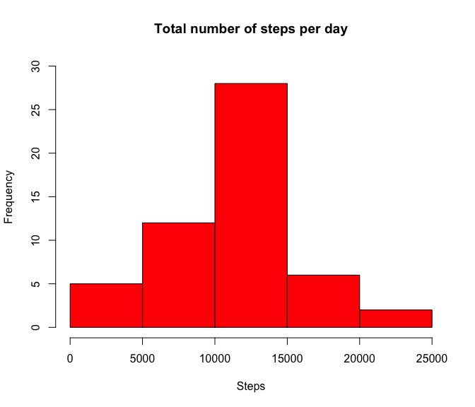
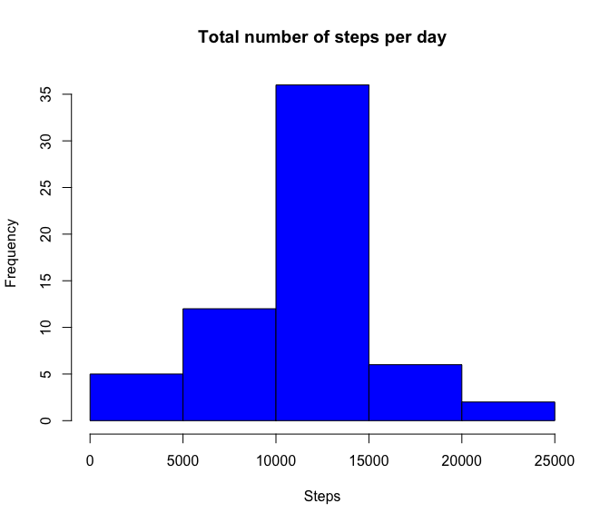
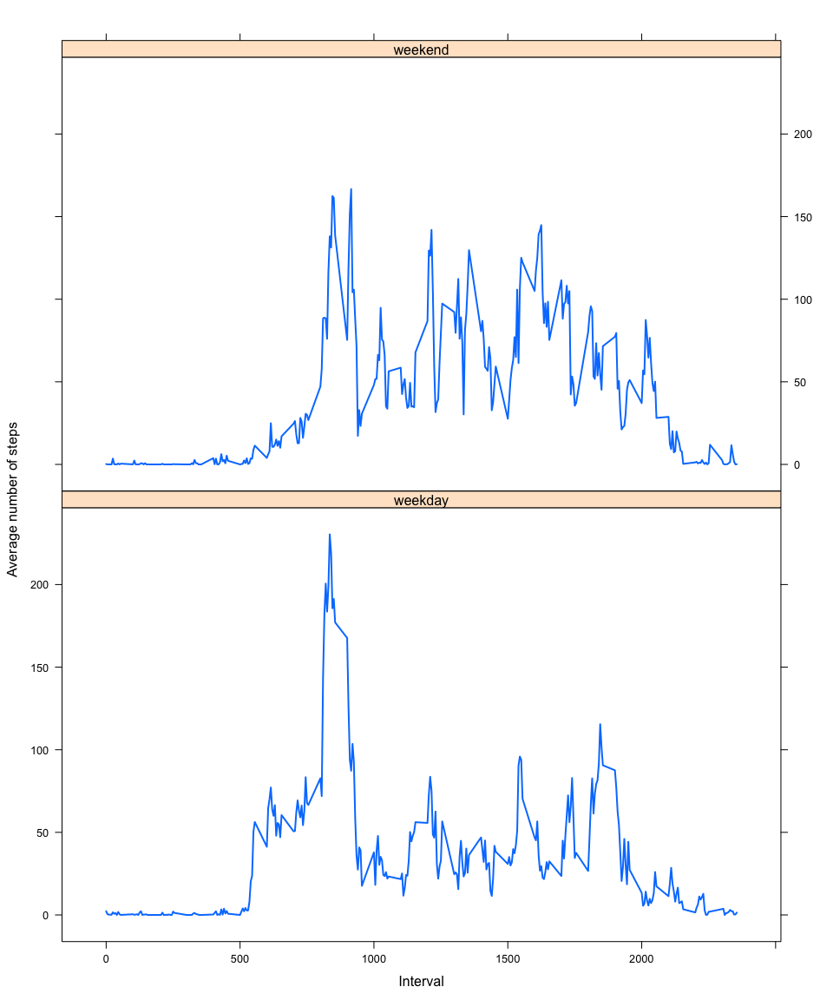

# Reproducible Research: Peer Assessment 1
#### Code for loading the data and transforming it to a suitable format
Downloads the file and unzips it into the working directory. Reads and performs initial data processing.

```r
download.file("https://d396qusza40orc.cloudfront.net/repdata%2Fdata%2Factivity.zip", destfile="./activity.zip", method="curl")
unzip("activity.zip", "activity.csv")
activ <- read.table("./activity.csv", header=TRUE, sep=",", nrows= 17568, 
  colClasses = c("numeric", "Date", "numeric"), stringsAsFactors=FALSE)
```

#### *Histogram of the total number of steps taken each day*
Plot the data for total steps taken by day

```r
activ$date <- as.Date(activ$date)
totalsteps <- aggregate(steps~date, activ, FUN=sum)
hist(totalsteps$steps, main="Total number of steps per day", ylim=c(0, 30), xlab="Steps", col="red")
```

 

#### *Mean and median of the total number of steps taken each day*

```r
mean(totalsteps$steps)
```

```
## [1] 10766
```

```r
median(totalsteps$steps)
```

```
## [1] 10765
```

#### Data frame summarizing the mean of steps by interval

```r
library(plyr)
byinterval <- ddply(activ, .(interval), summarise,  meansteps=mean(steps, na.rm=TRUE))
head(byinterval)
```

```
##   interval meansteps
## 1        0   1.71698
## 2        5   0.33962
## 3       10   0.13208
## 4       15   0.15094
## 5       20   0.07547
## 6       25   2.09434
```

```r
str(byinterval)
```

```
## 'data.frame':	288 obs. of  2 variables:
##  $ interval : num  0 5 10 15 20 25 30 35 40 45 ...
##  $ meansteps: num  1.717 0.3396 0.1321 0.1509 0.0755 ...
```

```r
summary(byinterval)
```

```
##     interval      meansteps     
##  Min.   :   0   Min.   :  0.00  
##  1st Qu.: 589   1st Qu.:  2.49  
##  Median :1178   Median : 34.11  
##  Mean   :1178   Mean   : 37.38  
##  3rd Qu.:1766   3rd Qu.: 52.83  
##  Max.   :2355   Max.   :206.17
```

#### *Time series plot of the 5-minute interval (x-axis) and the average number of steps taken, averaged across all days (y-axis)*
Plot the steps by interval

```r
plot(x=byinterval$interval, y=byinterval$meansteps, xlab="Time interval", xaxt="n", ylim=c(0, 210), ylab="Average steps per interval", type="l")
axis(side = 1, at = 500 * 0:4, labels = c("00:00", "05:00", "10:00", "15:00", "20:00"))
```

 

#### The interval with the maximum number of steps
Find the interval with the maximum number of steps. It is interval 835:

```r
maxinterval <- byinterval[which.max(byinterval$meansteps),]
maxinterval
```

```
##     interval meansteps
## 104      835     206.2
```

#### Calculate and report the total number of missing values in the dataset
This dataset has 2304 missing values:

```r
sum(is.na(activ))
```

```
## [1] 2304
```

### Replace missing values with the mean values for the given interval
#### Create new dataset with the missing values filled in 
The chosen strategy for replacing missing values is to fill in the NAs with the mean value for the respective interval. For the new dataset the initial one was first copied, and then a temporary column with the respective means per interval was added to facilitate looping over rows and replacement of NAs. At the end the helper column is removed, and the new dataset is ready to be used. The result is checked. 

```r
newactiv <- activ
num <- nrow(newactiv)/nrow(byinterval)
intmeans <- rep(byinterval$meansteps, times=num)
newactiv$meansteps <- intmeans

for(i in 1: nrow(newactiv)) { 
  if(is.na(newactiv[i,][1])) {
    newactiv$steps[i] = newactiv$meansteps[i]
  }
}
# Remove the extra column:
newactiv$meansteps <- NULL
# Check result:
head(newactiv)
```

```
##     steps       date interval
## 1 1.71698 2012-10-01        0
## 2 0.33962 2012-10-01        5
## 3 0.13208 2012-10-01       10
## 4 0.15094 2012-10-01       15
## 5 0.07547 2012-10-01       20
## 6 2.09434 2012-10-01       25
```

```r
# Check for missing values in the new set:
sum(is.na(newactiv))
```

```
## [1] 0
```

#### *Histogram of the total number of steps taken each day for the new dataset*
The histogram shows, however, that imputing the missing data changed the distribution of total numbers of steps per day and subsequently resulted in a histogram with a different shape.

```r
newactiv$date <- as.Date(newactiv$date)
newtotalsteps <- aggregate(steps~date, newactiv, FUN=sum)
hist(newtotalsteps$steps, main="Total number of steps per day", xlab="Steps", col="blue")
```

 

#### Report the mean and median total number of steps taken per day

```r
mean(newtotalsteps$steps)
```

```
## [1] 10766
```

```r
median(newtotalsteps$steps)
```

```
## [1] 10766
```

#### Conclusion 
The strategy for filling in the missing values resulted in no change for the mean, while the median has changed.

### Are there differences in activity patterns between weekdays and weekends?
Here a new categorical factor variable is setup to distinguish weekdays from weekends 

```r
newactiv$date <- as.Date(as.character(newactiv$date), "%Y-%m-%d")
temp <- vector()
temp[weekdays(newactiv$date) %in% c("Saturday", "Sunday")] = "weekend"
temp[!weekdays(newactiv$date) %in% c("Saturday", "Sunday")] = "weekday"
newactiv$day <- temp
newactiv$day <- as.factor(as.character(newactiv$day))
head(newactiv)
```

```
##     steps       date interval     day
## 1 1.71698 2012-10-01        0 weekday
## 2 0.33962 2012-10-01        5 weekday
## 3 0.13208 2012-10-01       10 weekday
## 4 0.15094 2012-10-01       15 weekday
## 5 0.07547 2012-10-01       20 weekday
## 6 2.09434 2012-10-01       25 weekday
```
#### Calculate the means for weekdays and weekends and store in a data frame
Then the means are calculated for each group, weekends and weekdays, and a data frame is created as to facilitate the plotting with the lattice package.

```r
weekday <- newactiv[newactiv$day == "weekday", ]
weekend <- newactiv[newactiv$day == "weekend", ]
weekdaymeans <- as.numeric(tapply(weekday$steps, weekday$interval, mean))
weekendmeans <- as.numeric(tapply(weekend$steps, weekend$interval, mean))
interval <- byinterval$interval
daysweek <- data.frame(interval, weekdaymeans, weekendmeans)
# Get the data into two separate data frames
label1 <- rep("weekday", times=length(interval))
df1 <- data.frame(interval, means=weekdaymeans, day=label1)
head(df1)
```

```
##   interval   means     day
## 1        0 2.25115 weekday
## 2        5 0.44528 weekday
## 3       10 0.17317 weekday
## 4       15 0.19790 weekday
## 5       20 0.09895 weekday
## 6       25 1.59036 weekday
```

```r
label2 <- rep("weekend", times=length(interval))
df2 <- data.frame(interval, means=weekendmeans, day=label2)
head(df2)
```

```
##   interval    means     day
## 1        0 0.214623 weekend
## 2        5 0.042453 weekend
## 3       10 0.016509 weekend
## 4       15 0.018868 weekend
## 5       20 0.009434 weekend
## 6       25 3.511792 weekend
```

```r
# Combine df1 and df2 and check result
byday <- rbind(df1, df2)
head(byday, 3)
```

```
##   interval  means     day
## 1        0 2.2512 weekday
## 2        5 0.4453 weekday
## 3       10 0.1732 weekday
```

```r
tail(byday, 3)
```

```
##     interval  means     day
## 574     2345 1.7052 weekend
## 575     2350 0.0283 weekend
## 576     2355 0.1344 weekend
```

```r
dim(byday)
```

```
## [1] 576   3
```

```r
byday$day <- as.factor(as.character(byday$day))
str(byday)
```

```
## 'data.frame':	576 obs. of  3 variables:
##  $ interval: num  0 5 10 15 20 25 30 35 40 45 ...
##  $ means   : num  2.251 0.445 0.173 0.198 0.099 ...
##  $ day     : Factor w/ 2 levels "weekday","weekend": 1 1 1 1 1 1 1 1 1 1 ...
```

#### *Make lattice plot for average steps on weekdays versus weekends*
Here is the time series plot.

```r
library(lattice)
require(lattice)
xyplot(means ~ interval | byday$day, byday, type="l", ylab="Average number of steps", layout=(c(1,2)), lwd=2, xlab="Interval")
```

 

